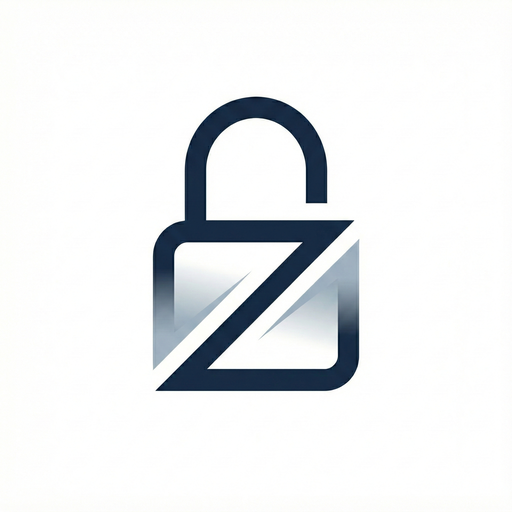

   

# ZenLock

ZenLock is a productivity app that helps you maintain focus by blocking distracting applications during dedicated focus sessions. With an accountability system to prevent impulsive early exits, ZenLock keeps you committed to your goals.

**Status**: Android published on Google Play. iOS published on App Store.

## Why ZenLock?

Most productivity apps lock essential features behind premium paywalls, yet still lack the critical functionality users actually need. ZenLock was built to solve this problem by offering a comprehensive, completely free solution with all features available to everyone.

Unlike other apps that charge for basic features like app blocking or focus timers, ZenLock includes advanced capabilities such as:
- Accountability system requiring partner verification for early unlock
- Comprehensive usage analytics and focus tracking
- Scheduled recurring focus sessions
- Customizable app whitelisting — no paywall on whitelisting :)

This project is open source to ensure transparency, encourage community contributions, and keep focus tools accessible to everyone.

## Features

### Core Functionality
- **Timed Focus Sessions** — set custom focus durations with hour and minute precision
- **App Blocking** — automatically blocks selected applications during focus sessions
- **Accountability System** — partner verification required to unlock a session early
- **App Whitelist / Allow Management** — configure which apps remain accessible during focus
- **Scheduled Sessions** — recurring focus schedules with customizable timing
- **Usage Statistics** — track your focus patterns and productivity metrics

### Platform-Specific Highlights
- **Android**: SMS-based OTP accountability, long-press session activation, Android 9+ support
- **iOS**: Apple Screen Time API (FamilyControls, ManagedSettings, DeviceActivity) for system-level blocking, custom shield UI, Home Screen widget, iOS 17+

## Platforms

### Android 
Java + Android Accessibility Service. Published on Google Play.
<a href="https://play.google.com/store/apps/details?id=com.grepguru.zenlock" target="_blank">Get it on Google Play</a>.

### iOS
Swift 6 + SwiftUI + Screen Time API. Built with native shields, friction screens, custom block UI, and a Home Screen widget.
<a href="https://apps.apple.com/us/app/zenlock-focus-app-blocker/id6774016090" target="_blank">Get it on App Store</a>.

## Usage

### Starting a Focus Session
1. Pick the apps to block (or block by category)
2. Set your duration
3. Start the session — selected apps are blocked until the timer expires

### Early Unlock
1. Request an early unlock from inside the app
2. **Android**: your accountability partner receives an SMS with a verification code; enter the code to unlock
3. **iOS**: a cool-down timer runs with your partner's name on screen and notifications during the wait

## Contributing

We welcome contributions! See [CONTRIBUTING.md](CONTRIBUTING.md) for guidelines on code style, pull requests, issue reporting, and testing.

Quick start:
1. Fork the repository
2. Create a feature branch: `git checkout -b feature/your-feature-name`
3. Commit your changes: `git commit -am 'Add new feature'`
4. Push to your fork and open a pull request

## Privacy

ZenLock collects nothing. There are no servers, no accounts, no telemetry. See [PRIVACY.md](PRIVACY.md).

## Security

- No telemetry, no remote logging
- Permission-based access control on both platforms
- Android: ProGuard obfuscation in release builds, SMS OTP for early unlock
- iOS: Apple Screen Time sandbox; opaque tokens for app selection — names/bundle IDs never visible to ZenLock

For security concerns or vulnerability reports, open a private security advisory or contact the maintainers directly.

## License

MIT — see [LICENSE](ZenLock-Android/LICENSE).

## Support

- **Issues**: [GitHub Issues](https://github.com/HumbleBee14/ZenLock/issues)
- **Discussions**: [GitHub Discussions](https://github.com/HumbleBee14/ZenLock/discussions)

---

Built with focus and dedication. Lock your Zen, lock your focus.
